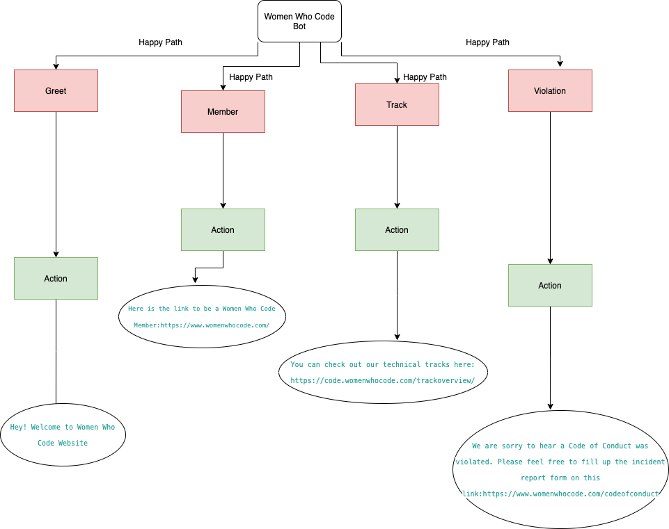
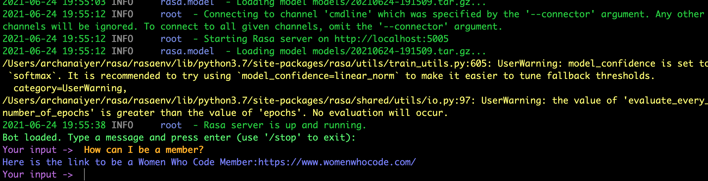

# WWCodechatbot

A simple chatbot built using Rasa

This is the structure. Currently it supports questions regarding:
1. Membership at Women Who Code
2. Technical Tracks at Women Who Code
3. Violation to Code of Conduct



To run the bot, run the following command 

```
rasa train
```

After it has trained, run the rasa shell to use the chatbot

```
rasa shell
```

Then the shell opens up in the terminal and you can ask questions like:




