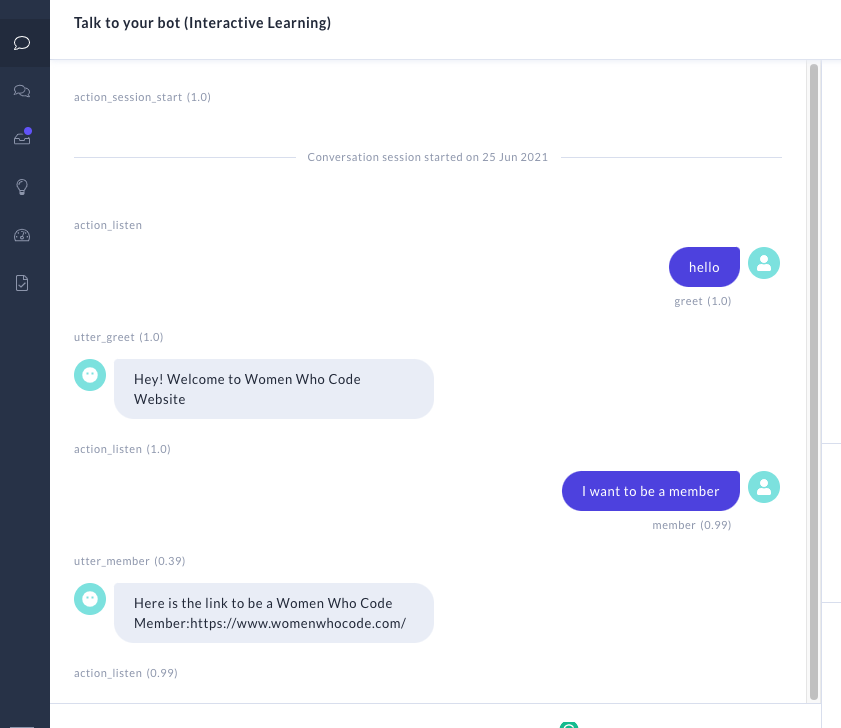
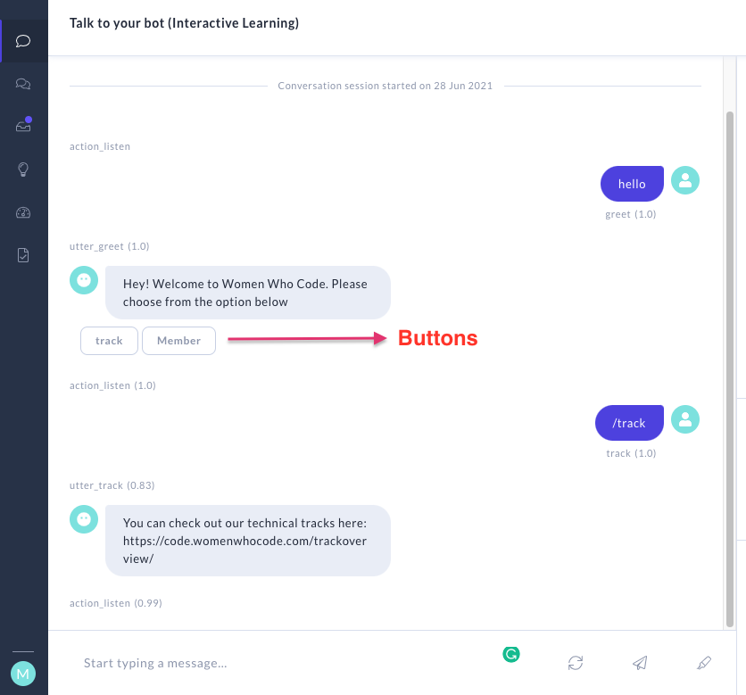

## Steps to Deploy the Chatbot

Currently the chatbot runs on the local mode, but can be accessed via a link with a https forwarding address. 

Steps to be followed:
1. Click [here](http://d20eaba40d6c.ngrok.io/) to access the bot
2. Ping me so that I can start the server
3. Get a password from me
4. You can see the screen below
5. After that, click on **Talk to the Bot** option on your left hand side panel and start chatting away



### Add buttons for intent

You can add buttons for users to choose from in the start. In this particular case, we will attaching it to the greet message and make minimal changes to the code on the domain.yml file.

```
responses:
  utter_greet:
  - buttons:
    - payload: /track
      title: track
    - payload: /member
      title: Member
    text: Hey! Welcome to Women Who Code. Please choose from the option below
  ```

Here is a look into the webapp with buttons.


